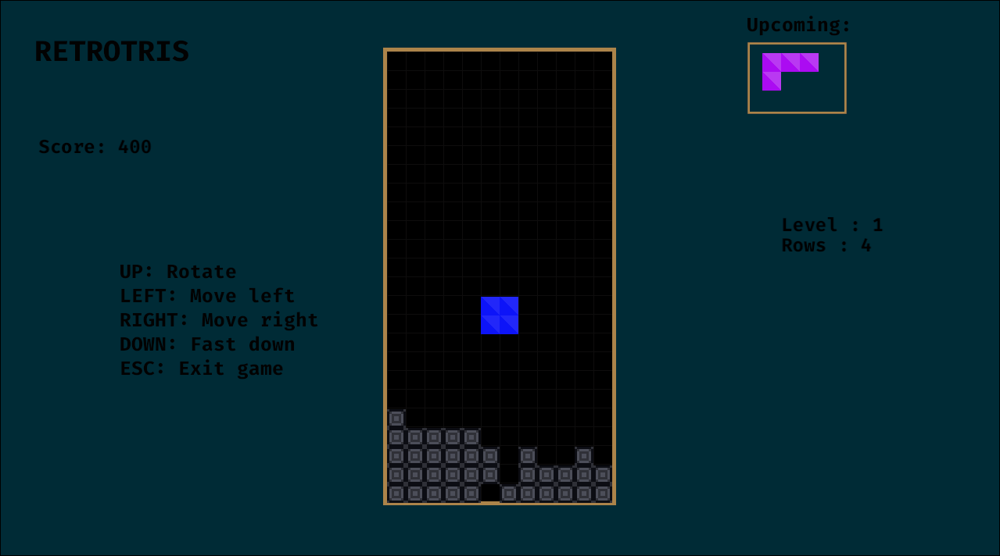

# retrotris

Retrotris is a Rust implementation of a classic puzzle game, powered by the Piston game engine. This project is crafted as a personal endeavor to explore the capabilities of the Piston engine and enhance Rust programming skills.

## Features

- Clear lines and increase your score as you progress.
- Challenge yourself with increasing difficulty levels.
- Enjoy the nostalgia of the iconic retro-puzzle gameplay.

### Build and run

1. Clone this repository to your local machine:

 ```sh
git clone https://github.com/geri1701/retrotris.git
  ```
 2. Navigate to the repo directory

```sh
cd retrotris
```
 3. Build and run the game

```sh
cargo run
```

### Contributing

Contributions are welcome! If you have any suggestions, bug fixes, or enhancements, feel free to submit a pull request.

### License

This project is licensed under the MIT License.

### Resources

- [Piston - a modular open source game engine](http://www.piston.rs/)
